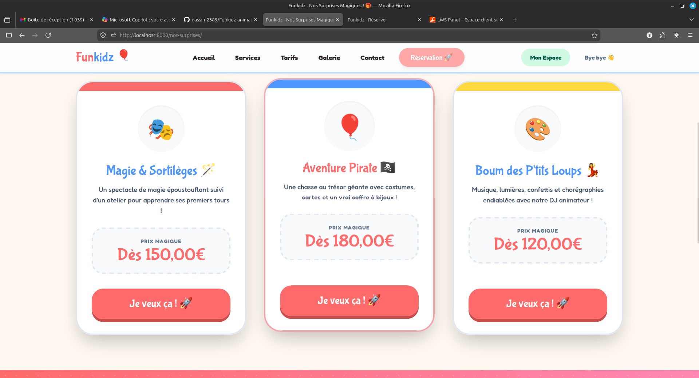
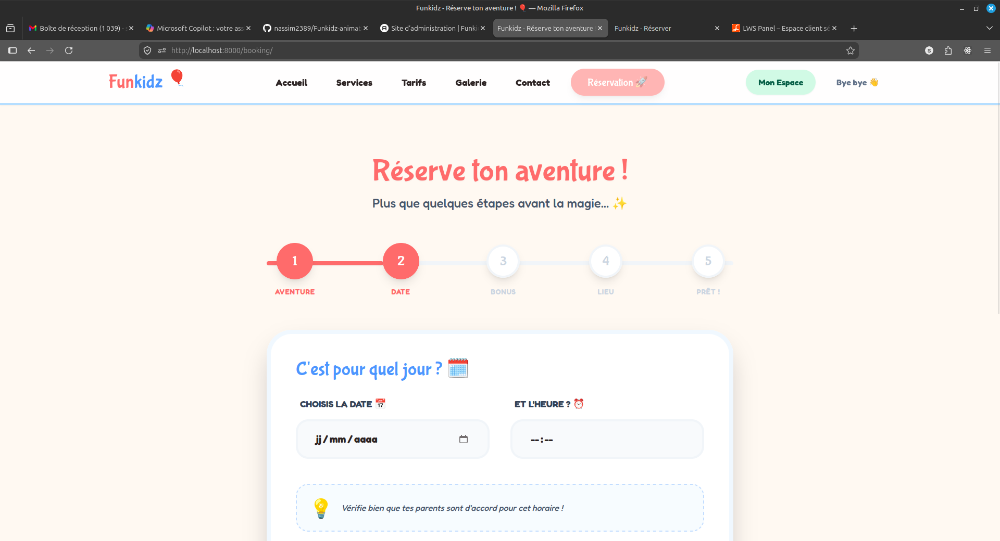
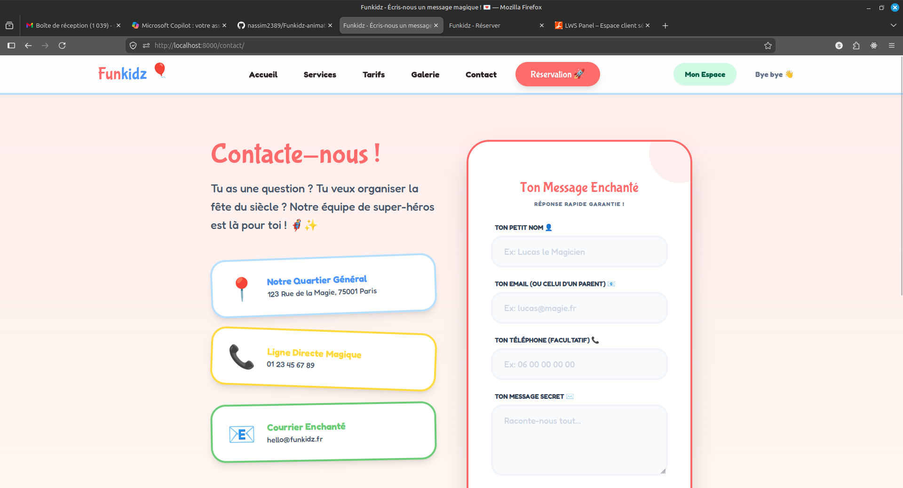
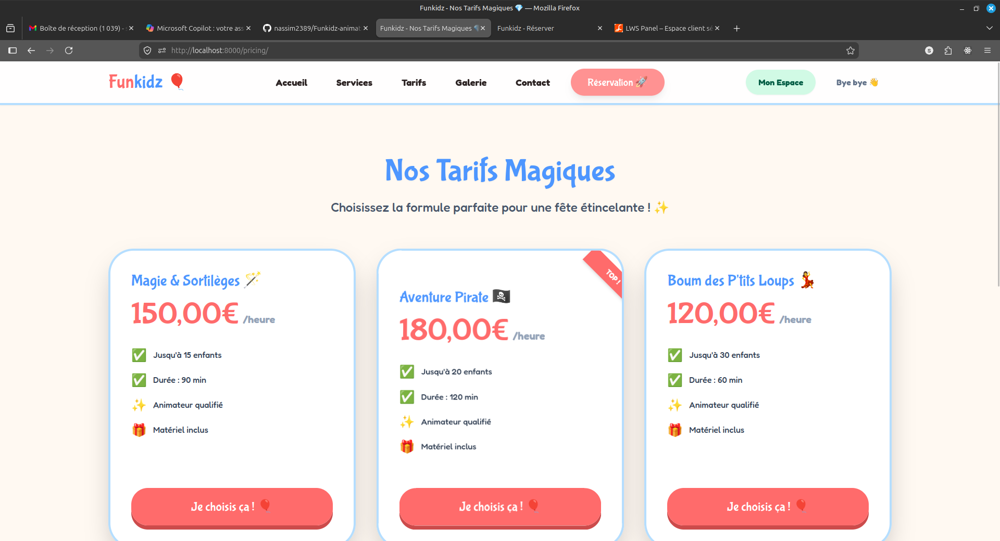

# 🎈 Funkidz Animation - Projet de Fin d'Études 🎓

Bienvenue dans le dépôt du projet **Funkidz Animation**, une plateforme complète de gestion d'animations pour enfants. Ce projet a été réalisé dans le cadre d'un **projet de fin d'études**, visant à créer une solution full-stack moderne, dynamique et ludique.

## ✨ Présentation du Projet
Funkidz est un site de services dynamique conçu spécialement pour émerveiller les enfants tout en offrant une gestion rigoureuse pour les parents et les animateurs. Le projet utilise **Django** pour la robustesse du backend et une combinaison de **Tailwind CSS** et **Alpine.js** pour une interface utilisateur réactive et "kid-friendly".

---

## 📸 Aperçu et Fonctionnalités

### 1. Accueil Magique
L'accueil plonge immédiatement l'utilisateur dans un univers coloré avec des animations et des boutons ludiques. C'est la porte d'entrée vers toutes les aventures.

### 2. Catalogue des Services
La page **Services** présente nos prestations sous forme de cartes vibrantes. Chaque service affiche son prix magique et un bouton pour réserver instantanément.

### 3. Tunnel de Réservation (Wizard)
Un formulaire interactif en plusieurs étapes (Aventure, Date, Bonus, Lieu) permet de planifier la fête parfaite de manière simple et amusante.

### 4. Contact Enchanté
Un formulaire de contact stylisé permet aux parents de poser leurs questions. Les messages sont directement enregistrés en base de données pour un suivi optimal.

### 5. Administration Premium (Espace Gestion)
Une interface d'administration complète et traduite en français permet de gérer les services, les réservations, les paiements et les messages de contact en toute simplicité.

---

## 🚀 Technologies Utilisées
- **Backend** : Django 6.0 (Python)
- **Frontend** : Django Templates, Tailwind CSS (Design sur mesure), Alpine.js
- **Base de données** : SQLite (Dev) / Prêt pour PostgreSQL (Prod)
- **API** : Django REST Framework
- **Gestion Admin** : Django Jazzmin (Interface modernisée)

## 🛠️ Installation et Lancement
1. Clonez le dépôt.
2. Créez un environnement virtuel : `python -m venv venv`.
3. Installez les dépendances : `pip install -r requirements.txt`.
4. Appliquez les migrations : `python manage.py migrate`.
5. Lancez le serveur : `python manage.py runserver`.

---

**Réalisé avec ✨ par [Votre Nom/Équipe] - Projet de Fin d'Études 2026**
