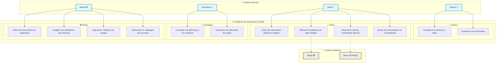

# 🎈 Funkidz Animation — Plateforme de Réservation & Gestion d'Animations 🎓

Bienvenue dans le dépôt du projet **Funkidz Animation**, une solution web complète de réservation, paiement et gestion d'animations événementielles pour enfants.

---

## ✨ Présentation du Projet

Funkidz est une plateforme web moderne et réactive conçue pour offrir une expérience fluide tant aux parents souhaitant réserver une animation qu'à l'équipe administrative et aux animateurs gérant les prestations.

Le projet s'appuie sur le framework **Django** pour le backend, **Django REST Framework** pour l'API REST, et une combinaison de **Vanilla CSS / Tailwind CSS** et **Alpine.js** pour une interface utilisateur dynamique, élégante et captivante.

---

## 🚀 Fonctionnalités Principales

### 1. 🌐 Espace Public & Expérience Client
- **Accueil Magique** : Page d'accueil moderne avec mise en valeur des formules populaires et appel à l'action immédiat.
- **Catalogue des Formules & Prestations** : Consultation détaillée des formules d'animation avec cartes illustrées en images HD et filtrage.
- **Tunnel de Réservation en 5 Étapes (Wizard)** :
  1. *Choix de la Formule*
  2. *Sélection de la Date & Heure* (Vérification des disponibilités en temps réel avec verrouillage des créneaux)
  3. *Options Complémentaires* (Châteaux gonflables, barbe à papa, mascottes, etc.)
  4. *Lieu & Détails de l'Événement*
  5. *Récapitulatif & Paiement*
- **Paiement Stripe & Mode Démo** : Intégration de Stripe Checkout et mode démo instantané pour tester la réservation.
- **E-mails de Confirmation Automatiques (Brevo)** : Envoi automatique d'un e-mail de confirmation détaillé dès la validation d'une réservation.
- **Formulaire de Contact** : Envoi de messages enregistrés en base de données avec notification automatique administrateur.

### 2. 🛠️ Panneau d'Administration & Gestion (Jazzmin Admin)
- **Interface Haute Lisibilité** : Thème haute visibilité et fort contraste avec navigation intuitive.
- **Gestion des Réservations & Paiements** : Consultation, validation, annulation et suivi des paiements.
- **Assignation des Animateurs** : Attribution des animateurs disponibles aux réservations confirmées.
- **Gestion des Congés & Planning** : Demande, validation ou refus des congés des animateurs (avec alertes e-mail automatiques) et plannings récurrents.
- **Galerie & Contenus** : Administration des formules, des options et de la galerie multimédia.

---

## 📊 Diagramme de Cas d'Utilisation


```mermaid
graph TD
    classDef internal fill:#e1f5fe,stroke:#0288d1,stroke-width:2px;
    classDef external fill:#efebe9,stroke:#5d4037,stroke-width:2px;
    classDef system fill:#fff,stroke:#333,stroke-width:2px;

    subgraph Acteurs_Internes ["👤 Acteurs Internes"]
        V["Visiteur 👤"]:::internal
        C["Client 💼"]:::internal
        A["Animateur 🎯"]:::internal
        AD["Admin 🛠️"]:::internal
    end

    subgraph Acteurs_Externes ["🔌 Acteurs Externes"]
        ST["Stripe 💳"]:::external
        EM["Brevo Email ✉️"]:::external
    end

    subgraph Système ["⚙️ Système de réservation Funkidz"]
        subgraph UC_Visiteur ["👤 Visiteur"]
            V1["Consulter les services et tarifs"]
            V2["Contacter via le formulaire"]
        end

        subgraph UC_Client ["💼 Client"]
            C1["Créer une réservation (Wizard 5 étapes)"]
            C2["Effectuer le paiement en ligne (Stripe)"]
            C3["Recevoir e-mail de confirmation (Brevo)"]
            C4["Suivre ses réservations sur le Dashboard"]
        end

        subgraph UC_Animateur ["🎯 Animateur"]
            AN1["Consulter son planning et ses missions"]
            AN2["Soumettre une demande de congé"]
        end

        subgraph UC_Admin ["🛠️ Admin"]
            AD1["Gérer les réservations et paiements"]
            AD2["Assigner les animateurs aux missions"]
            AD3["Approuver / Refuser les congés"]
            AD4["Administrer le catalogue des services"]
        end
    end

    V --> V1
    V --> V2
    C --> C1
    C --> C2
    C --> C3
    C --> C4
    A --> AN1
    A --> AN2
    AD --> AD1
    AD --> AD2
    AD --> AD3
    AD --> AD4
    C2 -.-> ST
    C3 -.-> EM
```

---

## 🛠️ Stack Technique

- **Backend** : Django 6.0 (Python 3.12)
- **API** : Django REST Framework, DRF Spectacular (OpenAPI 3)
- **Frontend** : Django Templates, Alpine.js, Tailwind CSS / Vanilla CSS
- **Paiements** : Stripe API & Webhooks
- **E-mails Transactionnels** : Brevo (ex-Sendinblue) SMTP / Django Mail
- **Base de Données** : SQLite (Développement) / Compatible PostgreSQL
- **Admin UI** : Django Jazzmin avec thème personnalisé à fort contraste

---

## 🪟 GUIDE D'INSTALLATION SOUS WINDOWS

Suivez attentivement les étapes ci-dessous pour installer et exécuter le projet sur un ordinateur Windows.

### 1. Prérequis nécessaires sur Windows
- **Python 3.10 ou supérieur** (Téléchargeable gratuitement sur [python.org](https://www.python.org/downloads/)).
  > ⚠️ **IMPORTANT lors de l'installation de Python** : Veillez impérativement à cocher la case **"Add Python to PATH"** au début de l'assistant d'installation.
- **Git** (Téléchargeable sur [git-scm.com](https://git-scm.com/downloads)).

---

### 2. Procédure étape par étape (Invite de commandes CMD ou PowerShell)

#### Étape 1 : Ouvrir l'Invite de Commandes Windows
Appuyez sur `Touche Windows + R`, tapez `cmd` puis appuyez sur `Entrée`.

#### Étape 2 : Cloner le dépôt GitHub et entrer dans le répertoire
```cmd
git clone https://github.com/nassim2389/Funkidz-animation-.git
cd Funkidz-animation-
```

#### Étape 3 : Créer et activer l'environnement virtuel Python
```cmd
python -m venv venv
venv\Scripts\activate
```
*(Si vous utilisez PowerShell et qu'un message d'erreur d'autorisation apparaît, tapez d'abord : `Set-ExecutionPolicy Unrestricted -Scope Process` puis relancez `venv\Scripts\activate`).*

#### Étape 4 : Installer les dépendances du projet
```cmd
pip install -r requirements.txt
```

#### Étape 5 : Configurer le fichier d'environnement `.env`
Créez un fichier texte nommé `.env` à la racine du projet (`Funkidz-animation-\.env`) avec le contenu suivant :

```env
DEBUG=True
SECRET_KEY=django-insecure-key-funkidz-demo-123456
DATABASE_URL=sqlite:///db.sqlite3

# Configuration Paiement Stripe (Localhost / Test)
STRIPE_API_KEY=sk_test_REMPLACER_PAR_VOTRE_CLE_STRIPE
STRIPE_WEBHOOK_SECRET=whsec_REMPLACER_PAR_VOTRE_WEBHOOK_STRIPE

# Configuration E-mails Brevo SMTP
EMAIL_HOST=smtp-relay.brevo.com
EMAIL_PORT=587
EMAIL_USE_TLS=True
EMAIL_HOST_USER=votre_utilisateur_brevo@smtp-brevo.com
EMAIL_HOST_PASSWORD=xsmtpsib-votre_cle_brevo_ici
DEFAULT_FROM_EMAIL=Funkidz <contact@funkidz.fr>
```

#### Étape 6 : Appliquer les migrations & Injecter les données de démonstration (Data Seeding)
Exécutez les deux commandes suivantes dans votre terminal :
```cmd
python manage.py migrate
python seed_all_data.py
```
> 🎉 Le script `seed_all_data.py` crée automatiquement l'ensemble des formules, des options, des avis, de la galerie photo ainsi que tous les comptes de test (Admin, Animateurs, Clients).

#### Étape 7 : Lancer le serveur local Django
```cmd
python manage.py runserver
```

---

### 🔑 Comptes de Test Pré-configurés pour la Démonstration

| Rôle | Adresse E-mail | Mot de passe |
| :--- | :--- | :--- |
| **Administrateur** | `admin@funkidz.fr` | `admin123` |
| **Animateur #1** | `animateur@funkidz.fr` | `animateur123` |
| **Animateur #2** | `sophie.anim@funkidz.fr` | `animateur123` |
| **Client #1** | `sedraniainaeuphredat@gmail.com` | `password123` |
| **Client #2** | `marie.dubois@gmail.com` | `password123` |

---

### 🌐 Accès aux Interfaces Web

- **Site Public & Réservation** : [http://127.0.0.1:8000/](http://127.0.0.1:8000/)
- **Panneau d'Administration** : [http://127.0.0.1:8000/admin/](http://127.0.0.1:8000/admin/)
- **Espace Client / Animateur** : [http://127.0.0.1:8000/dashboard/](http://127.0.0.1:8000/dashboard/)

---

**Réalisé avec ✨ pour Funkidz Animation — 2026**
