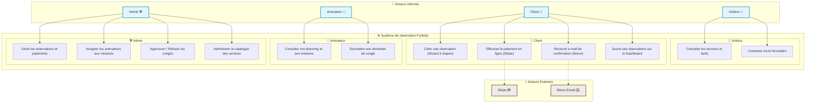

# 🎈 Funkidz Animation — Plateforme de Réservation & Gestion d'Animations 🎓

Bienvenue dans le dépôt du projet **Funkidz Animation**, une solution web complète de réservation, paiement et gestion d'animations événementielles pour enfants.

---

## ✨ Présentation du Projet

Funkidz est une plateforme web moderne et réactive conçue pour offrir une expérience fluide tant aux parents souhaitant réserver une animation qu'à l'équipe administrative et aux animateurs gérant les prestations.

Le projet s'appuie sur le framework **Django** pour le backend, **Django REST Framework** pour l'API REST, et une combinaison de **Vanilla CSS / Tailwind CSS** et **Alpine.js** pour une interface utilisateur dynamique, élégante et captivante.

---

## 🚀 Fonctionnalités Principales

### 1. 🌐 Espace Public & Expérience Client
- **Accueil Magique** : Page d'accueil moderne avec mise en valeur des formules populaires et appel à l'action immédiat.
- **Catalogue des Formules & Prestations** : Consultation détaillée des formules d'animation avec filtrage et tarification dynamique.
- **Tunnel de Réservation en 5 Éapes (Wizard)** :
  1. *Choix de la Formule*
  2. *Sélection de la Date & Heure* (Vérification des disponibilités en temps réel)
  3. *Options Complémentaires* (Châteaux gonflables, barbe à papa, mascottes, etc.)
  4. *Lieu & Détails de l'Événement*
  5. *Récapitulatif & Paiement*
- **Paiement Stripe & Mode Démo** : Intégration de Stripe Checkout et mode démo instantané pour tester la réservation sans clé bancaire.
- **E-mails de Confirmation Automatiques (Brevo)** : Envoi automatique d'un e-mail de confirmation détaillé dès la validation d'une réservation.
- **Formulaire de Contact** : Envoi de messages enregistrés en base de données avec notification administrateur.

### 2. 🛠️ Panneau d'Administration & Gestion (Jazzmin Admin)
- **Interface Haute Lisibilité** : Thème haute visibilité et fort contraste avec navigation intuitive.
- **Gestion des Réservations & Paiements** : Consultation, validation, annulation et génération de liens de paiement Stripe.
- **Assignation des Animateurs** : Attribution des animateurs disponibles aux réservations confirmées.
- **Gestion des Congés & Planning** : Demande, validation ou refus des congés des animateurs et plannings récurrents.
- **Galerie & Contenus** : Administration des formules, des options et de la galerie multimédia.

---

## 📊 Diagramme de Cas d'Utilisation


```mermaid
graph TD
    %% Styling
    classDef internal fill:#e1f5fe,stroke:#0288d1,stroke-width:2px;
    classDef external fill:#efebe9,stroke:#5d4037,stroke-width:2px;
    classDef system fill:#fff,stroke:#333,stroke-width:2px;

    %% Acteurs Internes
    subgraph Acteurs_Internes ["👤 Acteurs Internes"]
        V["Visiteur 👤"]:::internal
        C["Client 💼"]:::internal
        A["Animateur 🎯"]:::internal
        AD["Admin 🛠️"]:::internal
    end

    %% Acteurs Externes
    subgraph Acteurs_Externes ["🔌 Acteurs Externes"]
        ST["Stripe 💳"]:::external
        EM["Brevo Email ✉️"]:::external
    end

    %% Système Principal
    subgraph Système ["⚙️ Système de réservation Funkidz"]
        subgraph UC_Visiteur ["👤 Visiteur"]
            V1["Consulter les services et tarifs"]
            V2["Contacter via le formulaire"]
        end

        subgraph UC_Client ["💼 Client"]
            C1["Créer une réservation (Wizard 5 étapes)"]
            C2["Effectuer le paiement en ligne (Stripe)"]
            C3["Recevoir e-mail de confirmation (Brevo)"]
            C4["Suivre ses réservations sur le Dashboard"]
        end

        subgraph UC_Animateur ["🎯 Animateur"]
            AN1["Consulter son planning et ses missions"]
            AN2["Soumettre une demande de congé"]
        end

        subgraph UC_Admin ["🛠️ Admin"]
            AD1["Gérer les réservations et paiements"]
            AD2["Assigner les animateurs aux missions"]
            AD3["Approuver / Refuser les congés"]
            AD4["Administrer le catalogue des services"]
        end
    end

    %% Relations Acteurs -> Cas d'Utilisation
    V --> V1
    V --> V2

    C --> C1
    C --> C2
    C --> C3
    C --> C4

    A --> AN1
    A --> AN2

    AD --> AD1
    AD --> AD2
    AD --> AD3
    AD --> AD4

    %% Relations avec Services Externes
    C2 -.-> ST
    C3 -.-> EM
```

---

## 🛠️ Stack Technique

- **Backend** : Django 6.0 (Python 3.12)
- **API** : Django REST Framework, DRF Spectacular (OpenAPI 3)
- **Frontend** : Django Templates, Alpine.js, Tailwind CSS / Vanilla CSS
- **Paiements** : Stripe API & Webhooks
- **E-mails Transactionnels** : Brevo (ex-Sendinblue) SMTP / Django Mail
- **Base de Données** : SQLite (Développement) / Compatible PostgreSQL
- **Admin UI** : Django Jazzmin avec thème personnalisé à fort contraste

---

## ⚙️ Installation & Lancement en Local

### 1. Prérequis
- Python 3.12+
- Git

### 2. Cloner le projet et créer l'environnement virtuel
```bash
git clone https://github.com/nassim2389/Funkidz-animation-.git
cd Funkidz-animation-

python -m venv venv
source venv/bin/activate  # Sur Linux/macOS
# ou venv\Scripts\activate sous Windows
```

### 3. Installer les dépendances
```bash
pip install -r requirements.txt
```

### 4. Configurer les variables d'environnement (`.env`)
Créez un fichier `.env` à la racine :
```env
DEBUG=True
SECRET_KEY=votre_cle_secrete_django
DATABASE_URL=sqlite:///db.sqlite3

# Email Brevo SMTP
EMAIL_HOST=smtp-relay.brevo.com
EMAIL_PORT=587
EMAIL_USE_TLS=True
EMAIL_HOST_USER=votre_email_brevo
EMAIL_HOST_PASSWORD=votre_cle_smtp_brevo
DEFAULT_FROM_EMAIL=Funkidz <contact@funkidz.fr>
```

### 5. Appliquer les migrations & Lancer le serveur
```bash
python manage.py migrate
python manage.py runserver
```

L'application sera accessible sur **http://127.0.0.1:8000/** et l'administration sur **http://127.0.0.1:8000/admin/**.

---

**Réalisé avec ✨ par NASSIM — 2026**
