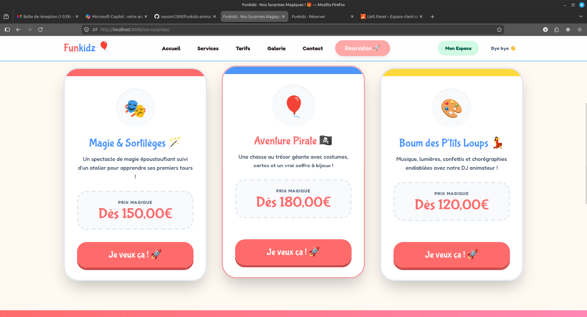
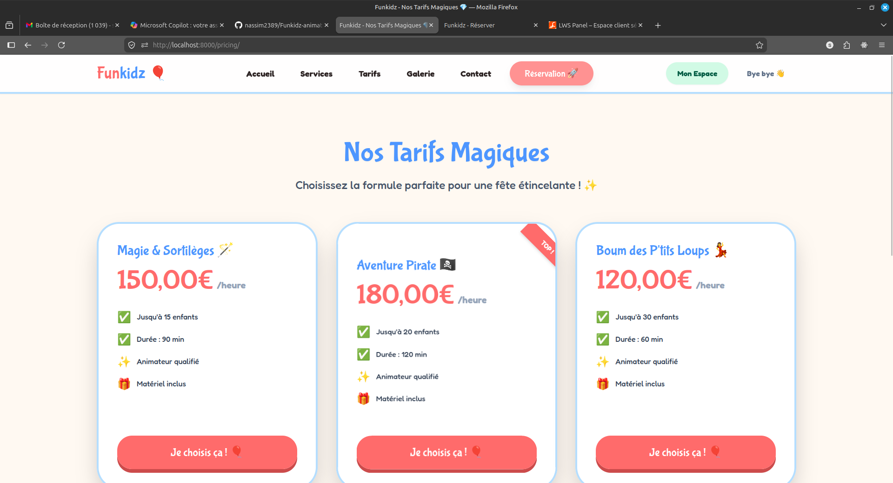
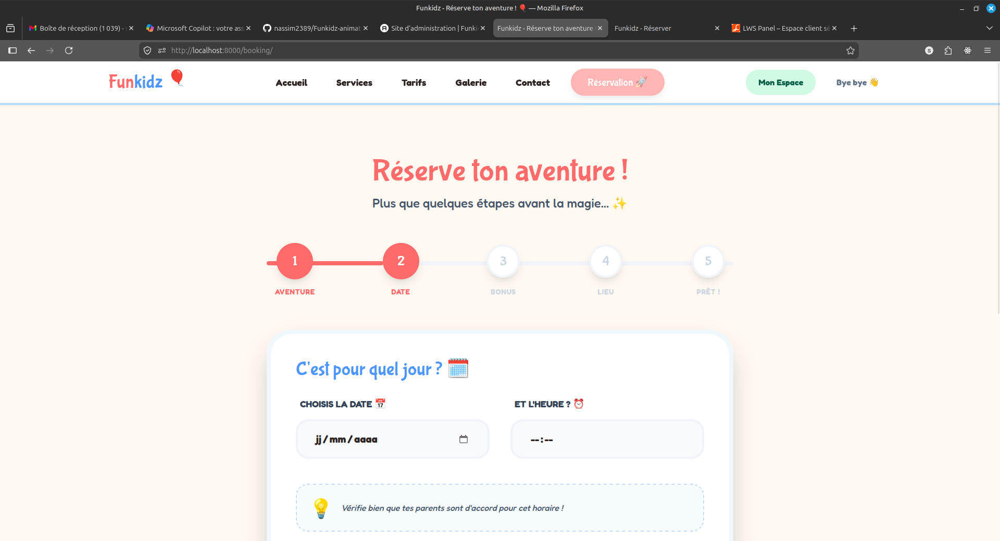
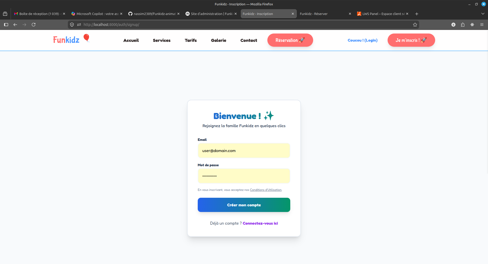
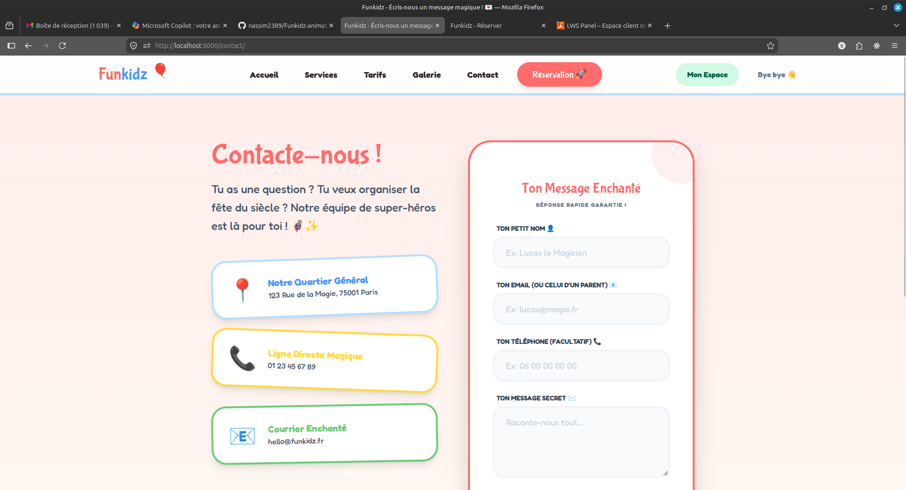
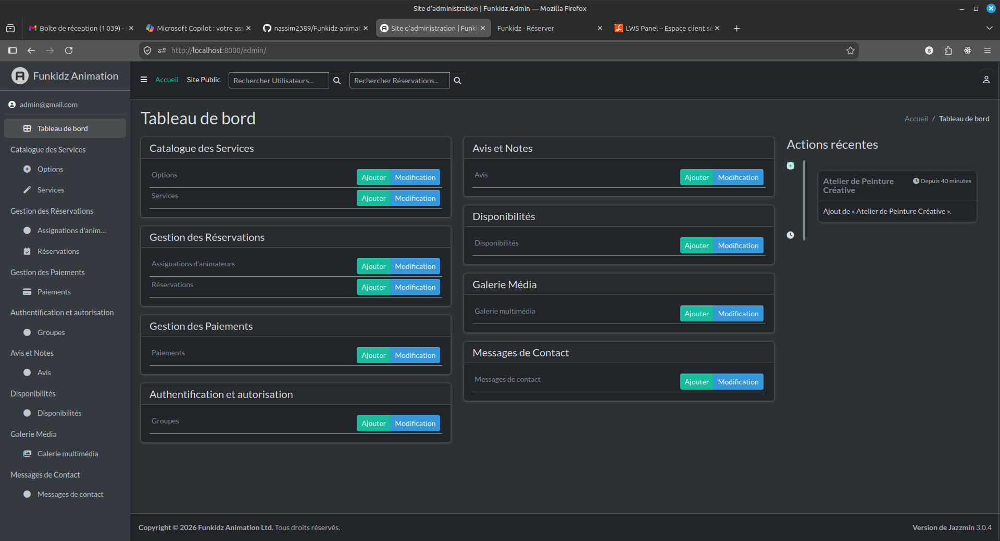

# 🎈 Funkidz Animation - Projet de Fin d'Études 🎓

Bienvenue dans le dépôt du projet **Funkidz Animation**, une plateforme complète de gestion d'animations pour enfants. Ce projet a été réalisé par **NASSIM** dans le cadre d'un **projet de fin d'études**, visant à créer une solution full-stack moderne, dynamique et ludique.

## ✨ Présentation du Projet
Funkidz est un site de services dynamique conçu spécialement pour émerveiller les enfants tout en offrant une gestion rigoureuse pour les parents et les animateurs. Le projet utilise **Django** pour la robustesse du backend et une combinaison de **Tailwind CSS** et **Alpine.js** pour une interface utilisateur réactive et "kid-friendly".

---

## 📸 Aperçu et Fonctionnalités

### 1. Accueil Magique
L'accueil plonge immédiatement l'utilisateur dans un univers coloré avec des animations et des boutons ludiques. C'est la porte d'entrée vers toutes les aventures avec un design attractif et moderne.

### 2. Catalogue des Services
La page **Services** présente nos prestations sous forme de cartes vibrantes. Chaque service affiche son prix magique et une description courte pour aider les parents à choisir la meilleure animation.

### 3. Grille Tarifaire
Une vue détaillée des tarifs permettant de comparer les différentes formules magiques proposées par Funkidz.

### 4. Tunnel de Réservation (Wizard)
Un formulaire interactif en plusieurs étapes (Aventure, Date, Bonus, Lieu) permet de planifier la fête parfaite de manière simple et amusante, avec une barre de progression pour guider l'utilisateur.

### 5. Espace de Connexion
Une interface de connexion sécurisée et stylisée pour permettre aux clients et aux animateurs d'accéder à leur espace personnel.

### 6. Contact Enchanté
Un formulaire de contact complet permettant aux utilisateurs d'envoyer des messages personnalisés. Les messages sont stockés en base de données pour une gestion centralisée.

### 7. Administration Premium (Espace Gestion)
L'interface d'administration (via Jazzmin) entièrement traduite en français. Elle permet de gérer les services, les réservations, les paiements et les utilisateurs avec une vue d'ensemble sur l'activité.

---

## 📊 Diagramme de Cas d'Utilisation

Ce diagramme de cas d'utilisation modélise les différentes interactions entre les acteurs (internes et externes) et le système de réservation.

```mermaid
graph TD
    %% Styling
    classDef internal fill:#e1f5fe,stroke:#0288d1,stroke-width:2px;
    classDef external fill:#efebe9,stroke:#5d4037,stroke-width:2px;
    classDef system fill:#fff,stroke:#333,stroke-width:2px;
    classDef usecase fill:#fff9c4,stroke:#fbc02d,stroke-width:1px,stroke-dasharray: 5 5;

    %% Acteurs Internes
    subgraph Acteurs_Internes ["👤 Acteurs Internes"]
        V["Visiteur 👤"]:::internal
        C["Client 💼"]:::internal
        A["Animateur 🎯"]:::internal
        AD["Admin 🛠️"]:::internal
    end

    %% Acteurs Externes
    subgraph Acteurs_Externes ["🔌 Acteurs Externes"]
        ST["Stripe 💳"]:::external
        EM["Email Service ✉️"]:::external
    end

    %% Système Principal
    subgraph Système ["⚙️ Système de réservation Funkidz"]
        subgraph UC_Visiteur ["👤 Cas d'utilisation - Visiteur"]
            V1["Voir les détails du service"]
            V2["Contacter via le formulaire"]
            V3["Consulter les tarifs"]
        end

        subgraph UC_Client ["💼 Cas d'utilisation - Client"]
            C1["Créer une réservation"]
            C2["Modifier une réservation"]
            C3["Recevoir confirmation"]
            C4["Télécharger facture"]
        end

        subgraph UC_Animateur ["🎯 Cas d'utilisation - Animateur"]
            AN1["Marquer la réservation comme terminée"]
            AN2["Consulter historique des missions"]
        end

        subgraph UC_Admin ["🛠️ Cas d'utilisation - Admin"]
            AD1["Confirmer ou refuser une réservation"]
            AD2["Créer un compte animateur"]
            AD3["Générer rapports de performance"]
            AD4["Gérer les paiements en attente"]
        end

        subgraph UC_Externes ["🔗 Services externes"]
            SE1["Traiter le paiement"]
            SE2["Envoyer une notification par email"]
            SE3["Synchroniser statut de paiement"]
        end
    end

    %% Légende des Acteurs
    subgraph Legende ["🔑 Légende des Acteurs"]
        style Legende fill:#f9f9f9,stroke:#999,stroke-width:1px
        L1["👤 Acteur Interne"]:::internal
        L2["🔌 Acteur Externe"]:::external
    end

    %% Relations Acteurs -> Cas d'Utilisation
    V --> V1
    V --> V2
    V --> V3

    C --> C1
    C --> C2
    C --> C3
    C --> C4

    A --> AN1
    A --> AN2

    AD --> AD1
    AD --> AD2
    AD --> AD3
    AD --> AD4

    %% Relations Cas d'Utilisation -> Services Externes
    SE1 --> ST
    SE2 --> EM
    SE3 --> ST

    C1 -.-> SE1
    C3 -.-> SE2
    C4 -.-> ST
    AD4 -.-> SE3
```

---

## 🚀 Technologies Utilisées
- **Backend** : Django 6.0 (Python)
- **Frontend** : Django Templates, Tailwind CSS (Design sur mesure), Alpine.js
- **Base de données** : SQLite (Dev) / Prêt pour PostgreSQL (Prod)
- **API** : Django REST Framework
- **Gestion Admin** : Django Jazzmin (Interface modernisée et personnalisée)

## 🛠️ Installation et Lancement
1. Clonez le dépôt.
2. Créez un environnement virtuel : `python -m venv venv`.
3. Installez les dépendances : `pip install -r requirements.txt`.
4. Appliquez les migrations : `python manage.py migrate`.
5. Lancez le serveur : `python manage.py runserver`.

---

**Réalisé avec ✨ par NASSIM - Projet de Fin d'Études 2026**
